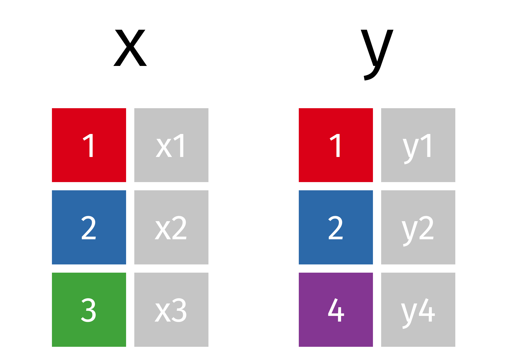
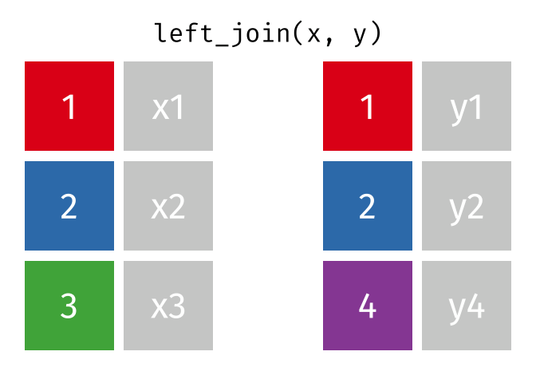

# Joins

## Let's start out with two data frames: x and y

```{r dfs}
#| echo: TRUE

x <- data.frame(id=c(1,2,3), x=c("x1", "x2", "x3"))

x
```

:::{.fragment}
```{r}
#| echo: TRUE
y <- data.frame(id=c(1,2,4), y=c("y1", "y2", "y4"))

y
```
:::

## Two data frames

```{r, echo=F, fig.retina=TRUE, out.width=800}

```


## left_join()


```{r left, warning=F, message=F}
#| echo: TRUE
library(dplyr)

left_join(x, y)
```


## left_join() illustrated




## Two data frames: x and y but with different column names

```{r dfs_again}
#| echo: TRUE
x <- data.frame(id=c(1,2,3), x=c("x1", "x2", "x3"))

x
```

::: {.fragment}
```{r}
#| echo: TRUE
y <- data.frame(new_id=c(1,2,4), y=c("y1", "y2", "y4"))

y
```
:::


:::{.fragment}
```{r left2}
#| echo: TRUE
left_join(x, y, by=c("id"="new_id"))
```
:::


## Watch out for repeated data

```{r left3}
#| echo: FALSE
x <- data.frame(id=c(1,2,3), 
                x=c("x1", "x2", "x3"))

x
```

```{r left4}
#| echo: FALSE
y <- data.frame(id=c(1,2,4,2), 
                y=c("y1", "y2", "y4", "y5"))

y
```

:::{.fragment}
```{r}
#| echo: TRUE
left_join(x, y)
```
:::


## Extra rows illustrated


## right_join()


## full_join()


## inner_join()


## anti_join()


## stringr package


## stringr functions

Key `stringr` functions:

In this section, we will learn the following `stringr` functions:

:::{.incremental}
* `str_to_upper()` `str_to_lower()` `str_to_title()`
* `str_trim()` `str_squish()`
* `str_c()`
* `str_detect()`
* `str_subset()`
* `str_sub()`
:::

## stringr in action

```{r str_to}
#| echo: TRUE

library(stringr)

test_text <- "tHiS iS A rANsOM noTE!"
```

:::{.fragment}
```{r}
#| echo: TRUE
str_to_upper(test_text)
```
:::

:::{.fragment}
```{r}
#| echo: TRUE
str_to_lower(test_text)
```
:::

:::{.fragment}
```{r}
#| echo: TRUE
str_to_title(test_text)
```
:::

## Trimming strings

```{r trim}
#| echo: TRUE
test_text <- "  trim both   "

test_text 
```

:::{.fragment}
```{r}
#| echo: TRUE
str_trim(test_text, side="both")
```
:::

:::{.fragment}
```{r}
#| echo: TRUE
str_trim(test_text, side="left")
```
:::

:::{.fragment}
```{r}
#| echo: TRUE
str_trim(test_text, side="right")
```
:::

:::{.fragment}
```{r}
#| echo: TRUE
messy_text <- "  sometimes  you get   this "
```
:::

:::{.fragment}
```{r}
#| echo: TRUE
str_squish(messy_text)
```
:::

## Combining strings

```{r str_c}
#| echo: TRUE
text_a <- "one"

text_b <- "two"

text_a

text_b
```

:::{.fragment}
```{r}
#| echo: TRUE
str_c(text_a, text_b)
```
:::

:::{.fragment}
```{r}
#| echo: TRUE
str_c(text_a, text_b, sep="-")
```
:::

:::{.fragment}
```{r}
#| echo: TRUE
str_c(text_a, text_b, sep=" and a ")
```
:::

:::{.fragment}
```{r}
#| echo: TRUE
str_c(text_a, " and a ", text_b)
```
:::

## Extracting strings

```{r extract}
#| echo: TRUE
test_text <- "Hello world"

test_text 
```

:::{.fragment}
```{r}
#| echo: TRUE
str_sub(test_text, start = 6)
```
:::

:::{.fragment}
```{r}
#| echo: TRUE
str_sub(test_text, end = 5) <- "Howdy"

test_text
```
:::


:::{.fragment}
```{r}
#| echo: TRUE
cn <- "Kemp County, Georgia"

cn 

str_replace(cn, " County, .*", "")
```
:::

## More stringr functions
More functions in [stringr](https://evoldyn.gitlab.io/evomics-2018/ref-sheets/R_strings.pdf) and more info on regular expressions [here](https://raw.githubusercontent.com/rstudio/cheatsheets/main/regex.pdf).

## parse_number()

(from the readr package)

```{r parse}
#| echo: TRUE

library(readr)
messy_numbers <- c("$5.00", "9,343,200", "6.0%")

messy_numbers
```

:::{.fragment}
```{r}
#| echo: TRUE
parse_number(messy_numbers)
```
:::


## Illustrated {background-color="white" background-image="slide_images/parse_number.png" background-size="100%" }


# Your turn

Run this to go through the exercises

```{r}
#| eval: FALSE
#| echo: TRUE
learnr::run_tutorial("3_a_joining", "chjr")
```


