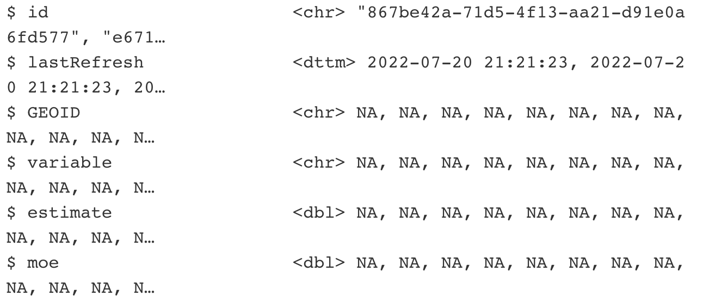

```{css, echo=FALSE}
.pageContent {
padding-top: 64px }
```

```{r setup, include=FALSE}
packages <- c("tidyverse", "lubridate", "rvest", "httr", "remotes", "readxl", "janitor")
if (length(setdiff(packages, rownames(installed.packages()))) > 0) {
  install.packages(setdiff(packages, rownames(installed.packages())), repos = "https://cran.us.r-project.org")  
}

#remotes::install_github("rstudio/gradethis", upgrade="always", quiet=TRUE)
#remotes::install_github("rstudio/learnr", upgrade="always", quiet=TRUE)

library(tidyverse)
library(learnr)
library(gradethis)
library(lubridate)
library(readxl)
library(janitor)
#myurl <- "https://www.cdc.gov/nchs/data/data_acces_files/NCHSURCodes2013.xlsx"
#download.file(myurl, (tf1 <- tempfile(fileext = ".xlsx")), mode = "wb")

#designations <- readxl::read_excel(tf1)
df <- read_csv("https://www.fema.gov/api/open/v2/DisasterDeclarationsSummaries.csv")


#county_pop <- read_csv("data/county_population.csv")
county_pop <- read_csv("https://www.andrewbatran.com/data/county_population.csv")

df_new <- df %>% 
  mutate(GEOID=str_c(fipsStateCode, fipsCountyCode))

joined_new <- left_join(df_new, county_pop, by="GEOID")
```

<span style="color:white">welcome to class!</span>

## Intro


We've done some basic exploring of the FEMA disaster declaration data. 

But there are only so many different ways to slice the data based on the variables in the original data set.

So we have to be creative and think of what other variables we can add.

Last time, we added some decades categories using the `case_when()` and `mutate()` functions.

But let's go even further by adding an additional data set.

Let's bring in county population data from the U.S. Census so we can estimate how many people were affected by different disasters.

For this exercise, the data's already pre-loaded but these are the commands to bring it in yourself using the excellent package called [**tidycensus**](https://learn.r-journalism.com/en/mapping/static_maps/static-maps/) (you'll need to sub in your own Census [API key](https://api.census.gov/data/key_signup.html)). Usually, you'd have to search for and download this from data.census.gov and do some manual cleaning up before using. But using this package that interfaces with the Census API using the lines of code below gives you the data cleaned up and in a **tidy** format.

```{r tidycensus, eval=FALSE}
# this is the code to bring in the data but it's already preloaded in this tutorial
library(tidycensus)
census_api_key("API_KEY_GOES_HERE")

county_pop <- get_acs(geography="county", variables="B01003_001", year=2020)
```

Let's take a moment to talk about the significance of **tidy** data. It's the prefix to a lot of the packages and functions we're using in this class. But it's also a philosophy when approaching the structure of data.

There's an ideal structure for how to stack your data.

And that's with 

1. Each **variable** is in its own **column**
2. Each **case** is in its own **row**
3. Each **value** is in its own **cell**

Let's take a look at the new `county_pop` data frame we imported from the Census API.

```{r glimpse_county_pop, exercise=TRUE}
# use the function on the object you just imported from the Census API
```


```{r glimpse_county_pop-solution}
glimpse(county_pop)
```


```{r glimpse_county_pop-hint}
The function starts with a *g*
```

```{r glimpse_county_pop-check}
grade_this_code()
```


Pay attention to the column names and what kind of data is in each column.

Next, let's take a look at our original FEMA data set.

```{r glimpse2, warning=F, message=F}
df <- read_csv("https://www.fema.gov/api/open/v2/DisasterDeclarationsSummaries.csv")
```

```{r glimpse, exercise=TRUE}
______(df)
```

```{r glimpse-solution}
glimpse(df)
```

```{r glimpse-hint}
The function starts with a *g*
```

```{r glimpse-check}
grade_this_code()
```


```{r quiz1, echo=FALSE}
quiz(caption = "Quiz 1",
  question("In each data set, which columns share the most similarity for locations?",
    answer('GEOID in df and placeCode in county_pop'),
    answer('designatedArea in df and NAME in county_pop', correct=T),
    answer('variable in county_pop and id in df'),
    answer('estimate in county_pop and disasterNumber in county_pop'),
    random_answer_order= TRUE
  ))
```

## Joins

A join combines two data sets by adding the columns of one data set alongside the columns of the other, usually some of the rows of the second data set along with some rows of the first data set.

A successful join requires something consistent between two data sets to match on: keys.

The function that's used most often is `left_join()` because you have one main data set you'd like to supplement with additional columns.

Here's how that looks in action:

```{r left-join-image, out.width = "400px", echo=F}
knitr::include_graphics("images/left-join.gif")
```

The function works like this:


**If the two data frames you want to join have the same name:**

```
left_join(data_frame1, data_frame2, by="shared_column_name")
```

**If the two data frames you want to join have *different* names:**

```
left_join(data_frame1, data_frame2, by=c("df1_column"="df_2_column"))
```

Notice that the `c()` argument in the second example is different from how we've used it before as combine. The `=` column matching operator is specific to `_join()` functions. Type `?left_join()` in the R console to see all the other arguments you can use.

Now there are a few other joins that have their uses.

* [right_join()](https://github.com/gadenbuie/tidyexplain/blob/main/images/right-join.gif)
* [full_join()](https://github.com/gadenbuie/tidyexplain/blob/main/images/full-join.gif)
* [semi_join()](https://github.com/gadenbuie/tidyexplain/raw/main/images/semi-join.gif)
* [anti_join()](https://github.com/gadenbuie/tidyexplain/raw/main/images/anti-join.gif)

So let's try to create a new dataframe object starting with the disaster declarations of `df`.

If you looked at the two dataframes in the last exercise, you saw that there were similarities in the county names.

```{r glimpse_again}
glimpse(df)
glimpse(county_pop)
```

Try the `left_join()` function below using the correct syntax and columns you identified.

```{r left_join, exercise=TRUE}
joined <- left_join(df, __________, by=_____________)

glimpse(joined)              
```


```{r left_join-solution}
joined <- left_join(df, county_pop, by=c("designatedArea"="NAME"))
                    
glimpse(joined)              
```

```{r left_join-hint}
Look at the example on how to join data frames with different column names above.
```

```{r left_join-check}
grade_this_code()
```

Alright, did this work?

We started out with 24 columns in `df` and now have 28 in the newly created `joined` data frame.

So columns were added. But did the data come with it?

When you scroll to the bottom of the `glimpse()` output you see a bunch of `NA`s.


```{r fail-image, out.width = "400px", echo=F}

```

### So what happened?

let's take a closer look at the first five data points in the two columns we joined on:

```{r closer, exercise=TRUE}
df %>% 
  select(designatedArea) %>% 
  slice(___) %>% 
  pull(designatedArea)

county_pop %>% 
  select(NAME) %>% 
  slice(___) %>% 
  pull(NAME)
```


```{r closer-solution}
df %>% 
  select(designatedArea) %>% 
  slice(1:5) %>% 
  pull(designatedArea)

county_pop %>% 
  select(NAME) %>% 
  slice(1:5) %>% 
  pull(NAME)
```

```{r closer-hint}
Don't forget the operator that represents "through"
```

```{r closer-check}
grade_this_code()
```

Alright, so even though they both contain county names the syntax is completely different.

The `df` data frame has parentheses around "County" and the `county_pop` data frame has a comma followed by the state names.

This is why the join ultimately failed. 

It's quite deceptive. You ran the code and didn't get an error.

This is why it's so important to get into the habit of checking for `NA`s after a join or inspecting the new data frame.

Failed joins have thrown off [many](https://www.thekeycuts.com/dear-analyst-a-spreadsheet-error-that-potentially-led-to-incorrect-economic-and-austerity-policies-after-2008-recession/) data analyses and will continue to do so.

**How to join these data sets**

The best way to join data is using a uniform identification number.

For the Census, they have standardized county numbers called GEOIDS. These geographical entities [also exist](https://www.census.gov/programs-surveys/geography/guidance/geo-identifiers.html) for census tracts and states and other Census boundaries.

So the `county_pop` data frame has a column called `GEOID` -- that's perfect!

It looks like `df` has a column called `fipsCountyCode` but if you joined on those two columns, you'd still fail.

That's because `GEOID` in `county_pop` is 5 characters wide and `fipsCountyCode` in `df` is 3 characters wide.

Data is rarely ready to join straight out the box. 

It will take some more wrangling to get these data sets to join.

If you've had some experience with working with Census data then you know a county GEOID has 5 characters.

Therefore we need to transform `fipsCountyCode` in `df` by adding `fipsStateCode` in front of it.

To do that, we'll use a new function from a new package, [**stringr**](https://stringr.tidyverse.org/).

## stringr intro

There are many wonderful functions in the [**stringr**](https://stringr.tidyverse.org/) package that you do things like detect patterns, see if strings start with with a pattern, or split or join or substitute strings. 

In this instance, we need to combine strings.

We'll use the `str_c()` function. *Get it? It's short for String Combine.*

Using `mutate()` we'll also name the new column the same one in the `county_pop` so it's easier to join.

```{r str_c, exercise=TRUE}
#library(stringr)
#if you've loaded tidyverse, you've already loaded stringr

df_new <- df %>% 
  mutate(GEOID=____(fipsStateCode, fipsCountyCode))

df_new %>% 
  select(fipsStateCode, fipsCountyCode, GEOID) %>% 
  glimpse()
```


```{r str_c-solution}
df_new <- df %>% 
  mutate(GEOID=str_c(fipsStateCode, fipsCountyCode))

df_new %>% 
  select(fipsStateCode, fipsCountyCode, GEOID) %>% 
  glimpse()
```

```{r str_c-hint}
function starts with an *s*.
```

```{r str_c-check}
grade_this_code()
```

Alright! Now let's join `df_new` and `county_pop` like before.


```{r left_join2, exercise=TRUE}
joined_new <- _____join(df_new, __________, by=_______)

glimpse(joined_new)              
```

```{r left_join2-solution}
joined_new <- left_join(df_new, county_pop, by="GEOID")
                    
glimpse(joined_new)              
```

```{r left_join2-hint}
Look at the example on how to join data frames with different column names above.
```

```{r left_join2-check}
grade_this_code()
```

Aha! We did it! 

Let's do some quick analysis on it.

## Summarize

Now that we have population data with every declared disaster, let's see which 5 disaster type affected the most people in 2021 (sorted high to low).

Fill in the missing code.

```{r summarize, exercise=TRUE}
joined_new %>% 
  mutate(year=____(incidentBeginDate)) %>% 
  filter(______) %>% 
  group_by(______) %>% 
  summarize(population=sum(estimate, na.rm=T)) %>% 
  arrange(______) %>% 
  slice(___)
```

```{r summarize-solution}
joined_new %>% 
  mutate(year=year(incidentBeginDate)) %>% 
  filter(year==2021) %>% 
  group_by(incidentType) %>% 
  summarize(population=sum(estimate, na.rm=T)) %>% 
  arrange(desc(population)) %>% 
  slice(1:5)
```

```{r summarize-hint}
This is a summation of all the functions you've used so far!
```

```{r summarize-check}
grade_this_code()
```

### Types of data

* **Categorical variables** are descriptive labels given to individual records, assigning them to different groups. The simplest categorical data is dichotomous, meaning that there are just two possible groups — in an election, for instance, people either voted, or they did not. More commonly, there are multiple categories. When analyzing traffic accidents, for example, you might consider the day of the week on which each incident occurred, giving seven possible categories.
* **Continuous data** is richer, consisting of numbers that can have a range of values on a sliding scale. When working with weather data, for instance, continuous variables might include temperature and amount of rainfall.

We also often need to consider date and time, which can be treated as continuous, like a sequence of years; or categorical, like the days of the week. A common task in data stories is to consider how the values for a variable or variables have changed over time.

### Interviewing data

The goal is to get used to asking questions of data by performing the following basic operations with the functions you've learned:

* **Sort**: Largest to smallest, oldest to newest, alphabetical etc.
* **Filter**: Select a defined subset of the data.
* **Summarize**: Derive one value from a series of other values to produce a summary statistic. Examples include:
  * **Count**. The number of records.
  * **Sum**. Add the values of a continuous variable.
  * **Mean** (aka average). The sum of values for a continuous variable divided by the count.
  * **Median**. The value in the middle, if the values for a continuous variable are sorted in ascending or descending order of magnitude.
  * **Max**, **Min**. The largest and smallest value for a continuous value, respectively.
* Math: Move the summarized data into a new sheet for additional analysis

Often you will **group by** a *categorical* variable first, and then summarize a *continuous* variable for each category.

Let's try to summarize a different way. We added up the population for all incident types in 2021. 

But this time, let's find the average and median population affected by all incident types in the entire data set.

Arrange it high to low (on avg_pop) and slice out the top 5 rows.

```{r summarize_again, exercise=TRUE}
joined_new %>% 
  group_by(___________) %>% 
  summarize(declarations=___,
            avg_pop=____(estimate, na.rm=T),
            median_pop=______(estimate, na.rm=T)) %>% 
  arrange(___________) %>% 
  slice(___)
```


```{r summarize_again-solution}
joined_new %>% 
  group_by(incidentType) %>% 
  summarize(declarations=n(),
            avg_pop=mean(estimate, na.rm=T),
            median_pop=median(estimate, na.rm=T)) %>% 
  arrange(desc(avg_pop)) %>% 
  slice(1:5)
```

```{r summarize_again-hint}
the function to find average is mean()
```

```{r summarize_again-check}
grade_this_code()
```

Pretty interesting, right? 

I don't know if this could lead to a story because the top three incident types that affected the highest average amount of people occurred so rarely. 

## Newsroom math

Nearly every news story that involves data analysis can be derived from one these formulas.

* Difference
  * x - y
* Percent
  * x / (x + y) * 100
* Percent change
  * (new - old)/old * 100
* Per Capita
  * x / population * some multiplier to raise result to a round number

So let's say we want to write a story about Kentucky flooding.

One thing we can ask is what has changed? Have things gotten worse or have things improved?

Let's wrangle the data so we can easily answer that.

We'll need to only compare the current months of 2022 with the past months (otherwise we'd be comparing 12 months of data in 2021 to 8 in 2022 which would be misleading).

```{r flooding}
joined_new %>% 
  filter(state=="KY") %>% 
  filter(incidentType=="Flood") %>% 
  mutate(year=year(incidentBeginDate)) %>% 
  # extracting months
  mutate(month=month(incidentBeginDate)) %>% 
  # only paying attention to months in current year of data set
  filter(month %in% c(1:8)) %>% 
  filter(year==2020 | year==2021 | year==2022) %>% 
  group_by(year) %>% 
  summarize(declarations=n(),
            avg_pop=mean(estimate, na.rm=T),
            median_pop=median(estimate, na.rm=T))
```

To answer the quiz, use this exercise box below.

```{r difference, exercise=TRUE}


```


```{r quiz2, echo=FALSE}
quiz(caption = "Quiz 2",
  question("How many more county Flood declarations were there in Kentucky in 2021 compared to 2022?",
    answer('3'),
    answer('30', correct=T),
    answer('-19'),
    answer('-5'),
    random_answer_order= TRUE
  ))
```

```{r quiz3, echo=FALSE}
quiz(caption = "Quiz 3",
  question("What's the percent change between county flood declarations in Kentucky between 2022 and 2021?",
    answer('-60', correct=T),
    answer('60'),
    answer('50'),
    answer('-100'),
    random_answer_order= TRUE
  ))
```

Great job so far.

Before we try out more math we'll need to learn more techniques to transform the data.

## Class III - Part 2

Stop this tutorial in the `Render` tab of RStudio (press the stop button).

Whew, that was a lot! Please, stand up and stretch.

Close this down!

When you're ready to move on to pt. 2 just type this in the console of RStudio:

```
learnr::run_tutorial("3_b_math_pivots", "chjr")
```
