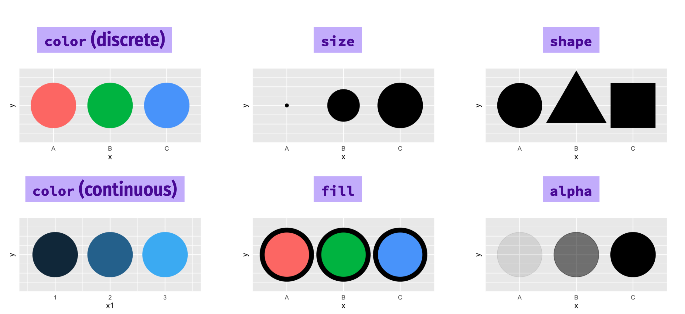
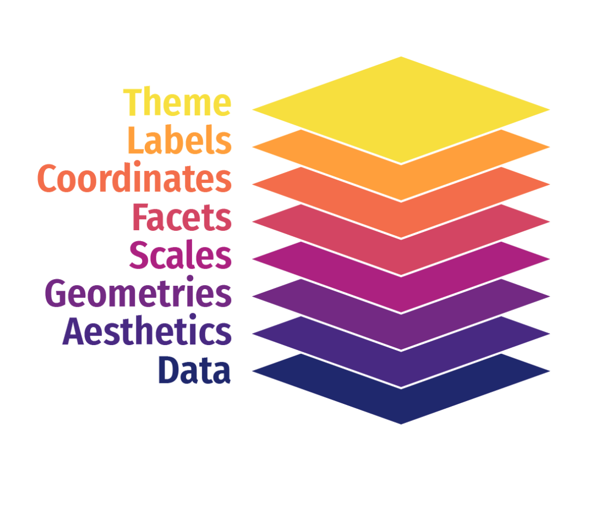

```{css, echo=FALSE}
.pageContent {
padding-top: 64px }

.cell-left {
  text-align: left;
}

.cell-right {
  text-align: right;
}

.cell-center {
  text-align: center;
}

table {
    margin: auto;
    border-top: 1px solid rgb(102, 102, 102);
    border-bottom: 1px solid rgb(102, 102, 102);
    display: table;
    border-collapse: separate;
    box-sizing: border-box;
    border-spacing: 2px;
    border-color: grey;
    padding-bottom:5px;
}
```

```{r setup, include=FALSE}
packages <- c("tidyverse", "lubridate", "rvest", "httr", "remotes", "knitr", "DT", "flair")
if (length(setdiff(packages, rownames(installed.packages()))) > 0) {
  install.packages(setdiff(packages, rownames(installed.packages())), repos = "https://cran.us.r-project.org")  
}

#remotes::install_github("rstudio/gradethis", upgrade="always", quiet=TRUE)
#remotes::install_github("rstudio/learnr", upgrade="always", quiet=TRUE)

library(tidyverse)
library(learnr)
library(gradethis)
library(lubridate)
library(readxl)
library(janitor)
library(knitr)
library(DT)
library(flair)
#myurl <- "https://www.cdc.gov/nchs/data/data_acces_files/NCHSURCodes2013.xlsx"
#download.file(myurl, (tf1 <- tempfile(fileext = ".xlsx")), mode = "wb")

#designations <- readxl::read_excel(tf1)
df <- read_csv("https://www.fema.gov/api/open/v2/DisasterDeclarationsSummaries.csv")

df_new <- df %>% 
  mutate(GEOID=str_c(fipsStateCode, fipsCountyCode))


#county_pop <- read_csv("data/county_population.csv")
county_pop <- read_csv("https://www.andrewbatran.com/data/county_population.csv")

joined_new <- left_join(df_new, county_pop, by="GEOID") %>% 
  mutate(year=year(incidentBeginDate))

annual_disasters <- joined_new %>% 
  count(incidentType, year, name="total") 
  
annual_fires <- annual_disasters  %>% 
  filter(incidentType=="Fire")


```

<span style="color:white">welcome to class!</span>


## Data Introduction

Before we begin, let's bring in the data we've been working with.

```{r imported, eval=F}
df <- read_csv("https://www.fema.gov/api/open/v2/DisasterDeclarationsSummaries.csv")

df_new <- df %>% 
  mutate(GEOID=str_c(fipsStateCode, fipsCountyCode))

county_pop <- read_csv("data/county_population.csv")

joined_new <- left_join(df_new, county_pop, by="GEOID") %>% 
  mutate(year=year(incidentBeginDate))
```


Let's take a look at what were working with. Check out `joined_new` with the usual function we use:

```{r glimpse, exercise=TRUE}

```


```{r glimpse-solution}
glimpse(joined_new)
```

```{r glimpse-hint}
function starts with an *g*.
```

```{r glimpse-check}
grade_this_code()
```

Okay, let's transform the data like we did before. 

Can you count up how many **disasters** there have been **per year**? Not total disasters. Individual disasters.

Call the new column "total".

```{r annual_disasters, exercise=TRUE}
annual_disasters <- joined_new %>% 

    
annual_disasters
```


```{r annual_disasters-solution}
annual_disasters <- joined_new %>% 
  count(incidentType, year, name="total") 
  
annual_disasters
```

```{r annual_disasters-hint}
You only need to add one new line. 
The function starts with a *c* and don't forget to name the column you're creating.
year should be the second argument in the function.
```

```{r annual_disasters-check}
grade_this_code()
```

Alright, we've got a lot of data going back decades. 

The benefit of working quickly with data in R is how you can quickly visualize it to spot any trends.

Let's do that.

But before we do, let's create another data frame specifically for fires.

Filter incidentType for "Fire", please.

```{r fires, exercise=TRUE}
annual_fires <- annual_disasters  %>% 

annual_fires
```


```{r fires-solution}
annual_fires <- annual_disasters  %>% 
  filter(incidentType=="Fire")

annual_fires
```

```{r fires-hint}
The function starts with a *f* and don't forget ==
```

```{r fires-check}
grade_this_code()
```


  

## Grammar of Graphics

The grammar of graphics lets you approach visualizations structurally, letting you combine and swap out graphical elements into figures that display data meaningfully.

It takes two lines of code.

This is what the code and chart looks like.

Run the code below.

```{r first_chart, exercise=TRUE}
ggplot(data=annual_fires) +
  geom_col(aes(x=year, y=total)) 
```

Basically, every of a chart can created using these aesthetic components and mapping them:

### Mapping data to aesthetics

**Aesthetic**

* The visual property of a graph

* Position, shape, color, etc.

**Data**

* A column in a data set

-----

Here's are the core components of the chart above:

<table>
  <tr>
    <th class="cell-left">Data</th>
    <th class="cell-left">Aesthetic</th>
    <th class="cell-left">Graphic/Geometry</th>
  </tr>
  <tr>
    <td class="cell-left">Year</td>
    <td class="cell-left">Position (x-axis)&emsp;</td>
    <td class="cell-left">Column</td>
  </tr>
  <tr>
    <td class="cell-left">Total disasters</td>
    <td class="cell-left">Position (y-axis)</td>
    <td class="cell-left">Point</td>
  </tr>
</table>

-----

Here's how the data was mapped in ggplot2 code from the `annual_fires` data frame:

<table>
  <tr>
    <th class="cell-left">Data</th>
    <th class="cell-left">aes()</th>
    <th class="cell-left">geom</th>
  </tr>
  <tr>
    <td class="cell-left">year</td>
    <td class="cell-left">x</td>
    <td class="cell-left">geom_col()</td>
  </tr>
  <tr>
    <td class="cell-left">total</td>
    <td class="cell-left">y</td>
    <td class="cell-left">geom_col()</td>
  </tr>
</table>


### ggplot() template

Here's the dataframe called `annual_fires` as a reminder:

```{r preview}
annual_fires %>% slice(1:5)
```

Okay, now that you see where all the pieces come from, here's how **ggplot()** works.

At its core you need to tell it what data you're using, what type of visual geometry you want to use, and what variables you want represented from the data.

**Important:** We have to use + signs between each line, not `%>%`. This is because **ggplot()** was created before the **tidyverse** piping method was established.

```{r show-ggplot-template, echo=FALSE, tidy=FALSE}
decorate('
ggplot(data = DATA) +
  GEOM_FUNCTION(mapping = aes(AESTHETIC MAPPINGS))
', eval = FALSE) %>% 
  flair("DATA", background = "#CBB5FF", before = "<b>", after = "</b>") %>% 
  flair("GEOM_FUNCTION", background = "#FFDFD1", before = "<b>", after = "</b>") %>% 
  flair("AESTHETIC MAPPINGS", background = "#FFD0CF", before = "<b>", after = "</b>") %>% 
  knit_print.with_flair()
```

---

```{r ggplot-template-example, echo=FALSE}
decorate('
ggplot(data = annual_fires +
  geom_col(mapping = aes(x = year, y = total)) 
', eval = FALSE) %>%
  flair("annual_fires", background = "#CBB5FF", before = "<b>", after = "</b>") %>% 
  flair("geom_col", background = "#FFDFD1", before = "<b>", after = "</b>") %>% 
  flair("x = year, y = total", background = "#FFD0CF", before = "<b>", after = "</b>") %>% 

  knit_print.with_flair()
```

---

```{r img0, echo = F, eval=FALSE, out.width="100%"}
library(knitr)
include_graphics("images/ggplot1.png")
``` 

### Grammatical layers

When constructing charts, so far we know about data, aesthetics, and geometries.

Think of these components as **layers**.

```{r img1a, echo = F, out.width="50%", fig.align="center"}

``` 

Add them to foundational `ggplot()` with +

These are all the arguments we can enhance the data viz with. 

Change the colors of the viz based on a column. Or the size of the shape.

Or the opacity or the gradient.

**Possible aesthetics**

```{r img2a, echo = F, out.width="100%"}

``` 

We can also swap out the different geometry types.

If you don't want a bar, you can use a line. Or a point.

You can even use shapefiles.

**Possible geoms**

```{r img3a, echo = F, out.width="60%", fig.align="center"}
include_graphics("images/ggplot3a.png")
``` 

THERE ARE [SO MANY GEOMS](https://twitter.com/search?q=geom_%20%23rstats&src=typed_query&f=image) for different visualizations. Here are the [official ones](https://ggplot2.tidyverse.org/reference/index.html#section-layer-geoms).

**Try the code from above again** but this time use **geom_point()** and then try it with **geom_line()**

```{r first_chart_geoms, exercise=TRUE}
ggplot(data=annual_fires) +
  geom______(aes(x=year, y=total)) 
```

You can really start to see the power of cycling quickly through different chart styles to see which one is most effective at telling the story you want to tell.

So after you have the very basic elements needed to create a chart, you can build and style it with more layers.

Because the defaults are rarely what you want and effective dataviz comes from small decisions you make along the way.

### Additional layers

There are many of other grammatical layers we can use to describe graphs.

We sequentially add layers onto the foundational `ggplot()` plot to create complex figures.


```{r img4a, echo = F, out.width="50%", fig.align="center"}

``` 

Scales change the properties of the variable mapping.

Here are a few examples:

<table>
  <tr>
    <th class="cell-left">Example layer</th>
    <th class="cell-left">What it does</th>
  </tr>
  <tr>
    <td class="cell-left"><code class="remark-inline-code">scale_x_continuous()</code></td>
    <td class="cell-left">Make the x-axis continuous</td>
  </tr>
  <tr>
    <td class="cell-left"><code class="remark-inline-code">scale_x_continuous(breaks = 1:5)&ensp;</code></td>
    <td class="cell-left">Manually specify axis ticks</td>
  </tr>
  <tr>
    <td class="cell-left"><code class="remark-inline-code">scale_x_date()</code></td>
    <td class="cell-left">Considers x-axis dates</td>
  </tr>
  <tr>
    <td class="cell-left"><code class="remark-inline-code">scale_color_gradient()</code></td>
    <td class="cell-left">Use a gradient</td>
  </tr>
  <tr>
    <td class="cell-left"><code class="remark-inline-code">scale_fill_viridis_d()</code></td>
    <td class="cell-left">Fill with discrete viridis colors</td>
  </tr>
</table>

----

Check out the x-axis.

### Exercise 2

Now add `scale_x_continuous(limits=c(2010, 2022), breaks=2010:2022)` to the bottom of the code.


```{r scented2, exercise=TRUE, warning=F, message=F}
ggplot(data=annual_fires) +
  geom_col(aes(x=year, y=total)) +


# Add line above this one
```

```{r scented2-solution}
ggplot(data=annual_fires) +
  geom_col(aes(x=year, y=total)) +
  scale_x_continuous(limits=c(2010, 2022), breaks=2010:2022)

```

```{r scented2-code-check}
grade_code()
```

Do you see the difference at the bottom of the chart compared to the one above it?

It limited the scope of the x-axis so it didn't go back to the '50s anymore.

And it specifically labeled the years 2010 through 2022.

## Facets

The next possible layer allows for small multiples. It's really neat.

Facets show subplots for different subsets of data.

<table>
  <tr>
    <th class="cell-left">Example layer</th>
    <th class="cell-left">What it does</th>
  </tr>
  <tr>
    <td class="cell-left"><code class="remark-inline-code">facet_wrap(vars(incidentType))</code></td>
    <td class="cell-left">Plot for each disaster type</td>
  </tr>
  <tr>
    <td class="cell-left"><code class="remark-inline-code">facet_wrap(vars(incidentType, year))</code>&emsp;</td>
    <td class="cell-left">Plot for each disaster type/year</td>
  </tr>
  <tr>
    <td class="cell-left"><code class="remark-inline-code">facet_wrap(..., ncol = 1)</code></td>
    <td class="cell-left">Put all facets in one column</td>
  </tr>
  <tr>
    <td class="cell-left"><code class="remark-inline-code">facet_wrap(..., nrow = 1)</code></td>
    <td class="cell-left">Put all facets in one row</td>
  </tr>
</table>

The table above shows all the different ways you can use facets-- you can break it out by one extra variable or even two.

We'll use the annual disasters this time so we have more than just the fires.

But we'll filter it to hurricanes and fires and floods.

And we can combine it with pipes before we use **ggplot()** it.

Add the `facet_wrap()` line on the variable **incidentType** (like the first example in the table above).

```{r facet_example1, exercise=TRUE, warning=F, message=F}
annual_disasters %>% 
  filter(incidentType %in% c("Hurricane", "Fire", "Flood")) %>% 
ggplot() +
  geom_col(mapping=aes(x= year, y= total)) +
  scale_x_continuous(limits=c(2010, 2022), breaks=2010:2022) +
  ______________________________
```

```{r facet_example1-solution}
annual_disasters %>% 
  filter(incidentType %in% c("Hurricane", "Fire", "Flood")) %>% 
ggplot() +
  geom_col(mapping=aes(x= year, y= total)) +
  scale_x_continuous(limits=c(2010, 2022), breaks=2010:2022) +
  facet_wrap(vars(incidentType))
```


```{r facet_example1-hint}
function starts with an *f*.
```

```{r facet_example1-check}
grade_this_code()
```

Alright, looks like the x-axis labels are getting a little crowded.

We can't even read it!

### Try again!

Now, try it with `ncol=1` as an additional argument in `facet_wrap()`


```{r facet_example2, exercise=TRUE, warning=F, message=F}
annual_disasters %>% 
  filter(incidentType %in% c("Hurricane", "Fire", "Flood")) %>% 
ggplot() +
  geom_col(mapping=aes(x= year, y= total)) +
  scale_x_continuous(limits=c(2010, 2022), breaks=2010:2022) +
  facet_wrap(vars(incidentType)_______)
```

```{r facet_example2-solution}
annual_disasters %>% 
  filter(incidentType %in% c("Hurricane", "Fire", "Flood")) %>% 
ggplot() +
  geom_col(mapping=aes(x= year, y= total)) +
  scale_x_continuous(limits=c(2010, 2022), breaks=2010:2022) +
  facet_wrap(vars(incidentType), ncol=1)
```


```{r facet_example2-hint}
function starts with an *f*.
Additional arguments in a function are separated with a comma.
```

```{r facet_example2-check}
grade_this_code()
```

## Labels

Now we can add more customization to the chart.

To make it really shine!

<table>
  <tr>
    <th class="cell-left">Example layer</th>
    <th class="cell-left">What it does</th>
  </tr>
  <tr>
    <td class="cell-left"><code class="remark-inline-code">labs(title = "Neat title")</code></td>
    <td class="cell-left">Title</td>
  </tr>
  <tr>
    <td class="cell-left"><code class="remark-inline-code">labs(caption = "Something")</td>
    <td class="cell-left">Caption</td>
  </tr>
  <tr>
    <td class="cell-left"><code class="remark-inline-code">labs(y = "Something")</td>
    <td class="cell-left">y-axis</td>
  </tr>
  <tr>
    <td class="cell-left"><code class="remark-inline-code">labs(color = "Type")</code></td>
    <td class="cell-left">Title of size legend</td>
  </tr>
</table>

* Title should be "Disaster declarations since 2010"
* Label for the x-axis should be blank (aka "") because the years are obvious
* Label for the y-axis should be "Total"
* Caption should be "Data: FEMA"

Add those labels below:

```{r labels_example, exercise=TRUE, warning=FALSE, message=FALSE}
annual_disasters %>% 
  filter(incidentType %in% c("Hurricane", "Fire", "Flood")) %>% 
ggplot() +
  geom_col(mapping=aes(x= year, y= total)) +
  scale_x_continuous(limits=c(2010, 2022), breaks=2010:2022) +
  facet_wrap(vars(incidentType), ncol=1) +
  labs(
    
    
    
    
  )
```

```{r labels_example-solution}
annual_disasters %>% 
  filter(incidentType %in% c("Hurricane", "Fire", "Flood")) %>% 
ggplot() +
  geom_col(mapping=aes(x= year, y= total)) +
  scale_x_continuous(limits=c(2010, 2022), breaks=2010:2022) +
  facet_wrap(vars(incidentType), ncol=1) +
  labs(
    title = "Disaster declarations since 2010",
    x = "",
    y = "Total",
    caption= "Data: FEMA"
  )
```

```{r labels_example-hint}
You only need to call labs() once.
Within parentheses, just separate the arguments with commas. You don't use the plus signs.
```

```{r labels_example-check}
grade_this_code()
```


## Themes

Change the appearance of anything in the plot.

While you can customize every font, color, gradient, etc, you can set these styles up ahead of time or use the ones others have created.

There are many built-in themes.


<table>
  <tr>
    <th class="cell-left">Example layer</th>
    <th class="cell-left">What it does</th>
  </tr>
  <tr>
    <td class="cell-left"><code class="remark-inline-code">theme_grey()</code></td>
    <td class="cell-left">Default grey background</td>
  </tr>
  <tr>
    <td class="cell-left"><code class="remark-inline-code">theme_bw()</td>
    <td class="cell-left">Black and white</td>
  </tr>
  <tr>
    <td class="cell-left"><code class="remark-inline-code">theme_dark()</td>
    <td class="cell-left">Dark</td>
  </tr>
  <tr>
    <td class="cell-left"><code class="remark-inline-code">theme_minimal()</code></td>
    <td class="cell-left">Minimal</td>
  </tr>
</table>

Try out the different themes listed above in the code below.

```{r themes-example, exercise=TRUE, warning=FALSE, message=FALSE}
annual_disasters %>% 
  filter(incidentType %in% c("Hurricane", "Fire", "Flood")) %>% 
ggplot() +
  geom_col(mapping=aes(x= year, y= total)) +
  scale_x_continuous(limits=c(2010, 2022), breaks=2010:2022) +
  facet_wrap(vars(incidentType), ncol=1) +
  labs(
    title = "Disaster declarations since 2010",
    x = "",
    y = "Total",
    caption= "Data: FEMA"
  ) +
  theme______()
```

### More themes

There are a collections of pre-built themes online, like the [ggthemes package](https://jrnold.github.io/ggthemes/).

Organizations often make their own custom themes, like [the BBC](https://bbc.github.io/rcookbook/).


```{r img10, echo = F, out.width="100%"}
include_graphics("images/bbc-cookbook.png")
``` 

### Theme adjustments

Make theme adjustments with `theme()`

There are a billion options here!

Add this chunk of code in the exercise below it:

```{r eval=F}
theme_bw() + 
theme(plot.title = element_text(face = "bold"),
      panel.grid = element_blank(),
      axis.title.y = element_text(face = "italic"))
```

### Exercise 5

```{r themes_example2, exercise=TRUE}
annual_disasters %>% 
  filter(incidentType %in% c("Hurricane", "Fire", "Flood")) %>% 
ggplot() +
  geom_col(mapping=aes(x= year, y= total)) +
  scale_x_continuous(limits=c(2010, 2022), breaks=2010:2022) +
  facet_wrap(vars(incidentType), ncol=1) +
  labs(
    title = "Disaster declarations since 2010",
    x = "",
    y = "Total",
    caption= "Data: FEMA"
  ) +

# copy and paste the chunk of code above this chunk into the line above this one
```


```{r themes_example2-solution}
annual_disasters %>% 
  filter(incidentType %in% c("Hurricane", "Fire", "Flood")) %>% 
ggplot() +
  geom_col(mapping=aes(x= year, y= total)) +
  scale_x_continuous(limits=c(2010, 2022), breaks=2010:2022) +
  facet_wrap(vars(incidentType), ncol=1) +
  labs(
    title = "Disaster declarations since 2010",
    x = "",
    y = "Total",
    caption= "Data: FEMA"
  ) +
  theme_bw() + 
  theme(plot.title = element_text(face = "bold"),
        panel.grid = element_blank(),
        axis.title.y = element_text(face = "italic"))
```

```{r themes_example2-code-check}
grade_this_code()
```


These were just a few examples of layers.

```{r img11, echo = F, fig.align="center", out.width="50%"}
include_graphics("images/ggplot5.png")
``` 

See the [ggplot2 documentation](https://ggplot2.tidyverse.org/reference/index.html) for complete examples of everything you can do

### Done!

Congrats on completing the walkthroughs for Class 4!
