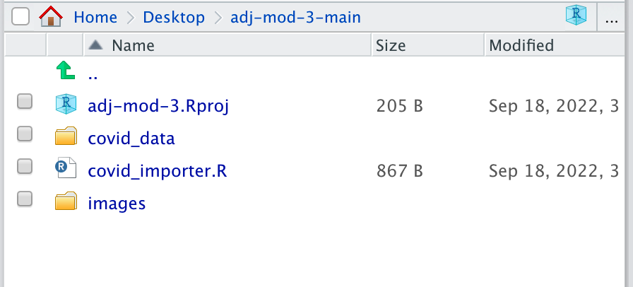
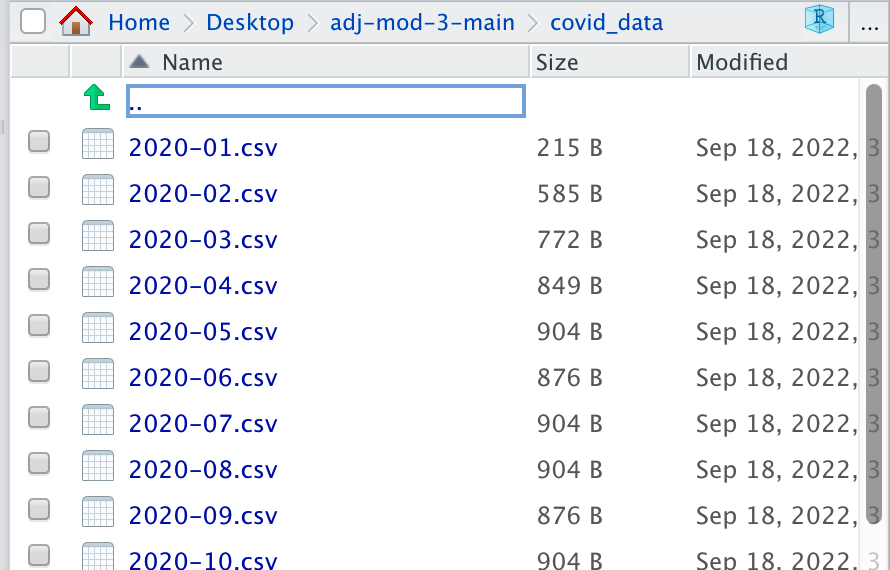
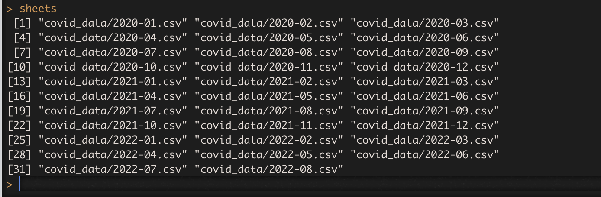
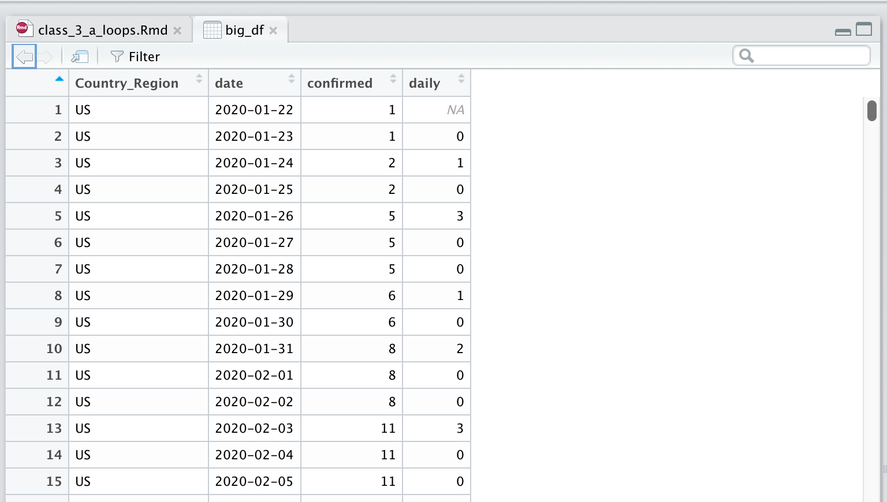

The answers to all the fill-in-the-blank sections can be found [here]((https://github.com/r-journalism/chjr/blob/main/inst/tutorials/loops/loops.Rmd).


```{r, warning=F, message=F}
library(tidyverse)
```

Before we move on, we need to go over some programming fundamentals.

One of which is how to create loops to simplify repetitive tasks.

Here's a basic "for loop" which includes setting the limits for the loop to 10.

Please copy and paste this and run in your RStudio console.

```{r loop1, eval=F}
print(1)

print(2)

print(3)

print(4)
```

Now, open up an R script and copy and paste this in it.

Run the lines of code.

```{r loop1b, eval=F}
for (i in 1:4) {
  print(i)
}
```

What do you get?

Manually, this would have looked like `print(1)` then `print(2)` then `print(3)` one by one.

But this is a way to run code many times with slight variations to a value or values in the code. It all goes between the `{` and `}`.

What this did was it said `i` is 1 in the first loop.

The only function we used in the loop was to print whatever `i` was.

At the end it started over and moved `i` to the next number, 2.

Because we put `1:4` then it looped 4 times and then stopped.

Try it again in the code above with another number if you want.

**Note:** Using `i` is arbitrary. You could use any letter or object. But it does take the value of what shows up after `in`.

But we keep it simple because we'll be using that object often in the loop.

Other examples:

Copy and paste the code below in your R script but this time in between the `print()` function put in `arbitrary_name` in the blanks.

```{r loop2, eval=F}
states <- c("Texas", "Florida", "California", "New York", "Indiana", "Maine")

for (arbitrary_name in 1:length(states)) {
  print(______________)
}
```

```{r loop2-solution, eval=F, echo=F}
states <- c("Texas", "Florida", "California", "New York", "Indiana", "Maine")

for (arbitrary_name in 1:length(states)) {
  print(arbitrary_name)
}
```


**Important:** In the code above instead of 1:6, we typed `1:length(states)` which is the same thing as `1:6`.

But it's more generalized so we don't have to always look up how many objects there are in the array.

**Note** Remember, if you want to see how many objects there are in an array, use `length()` and if you want to see how many rows there are in a data frame, use `nrow()` and if you want to see how many columns there are in a data frame, use `ncol()`.

Notice that the output in the console were not the names of the states we have in our list because the object that's looping is a number. 

If you want to loop AND print the names in the array, you'll have to refer to the array and the loop number with brackets.

Plug in the function from **stringr** that concatenates strings together because that's what we're printing to the console.

Also! Notice how I'm using the `[i]` to pull out the state name from the array based on the ordering?

```{r loop3, eval=F}
states <- c("Texas", "Florida", "California", "New York", "Indiana", "Maine")

for (i in 1:length(states)) {
  print(_____("array object ", i, " is ", states[i]))
}
```


```{r loop3-solution, eval=F, echo=F}
states <- c("Texas", "Florida", "California", "New York", "Indiana", "Maine")

for (i in 1:length(states)) {
  print(str_c("array object ", i, " is ", states[i]))
}
```


Excellent! Those are the basics of loops.

Let's apply that now for a practical purpose.

## Set up files

For these next steps, you're going to toggle between coding in RStudio while following this tutorial. You'll have to swap back and forth often. This is to get you more comfortable with coding in scripts and the console and not just in the safety of these exercises.

First, make sure you've downloaded the files by downloading [this zip file](https://drive.google.com/file/d/148GXj-OjkwxJ2jGe8-Zh-bBt5O9UmpZM/view?usp=sharing) of covid data.

Extract it into the working directory of where your RStudio project currently is.

It should look something like this in your working directory (mine is `adj-mod-3-main`) but yours will be something totally different.

Let's test that out with the data you downloaded:

```{r files_image1, out.width = "400px", echo=F}

```

These are the files you should have.

This is what it looks like in your `covid_data` folder in your current folder:

```{r files_image2, out.width = "400px", echo=F}

```


Let's bring in a couple data sets and make sure their structures are similar.

Run these lines in your console.

It should work if you set up your folder directories correctly.

```{r, eval=F}
# have to load in the r package to import data!
library(readr)

df1 <- read_csv("covid_data/2020-01.csv")

df2 <- read_csv("covid_data/2020-02.csv")

View(df1)
View(df2)
```

You've imported two months of Covid-19 data and then run commands to view the table in RStudio.

When you toggle back and forth between the table view of **df1** and **df2** you see the column names are the same, which is good.

Let's join them together. Type this out in your console:

```
df <- rbind(df1, df2)

View(df)
```

## Loops to read in data files

If you had to write a line of code to import every spreadsheet in the `covid_data` folder, that would take a long, long time because there are dozens!

Sometimes you're going to get data split out over several spreadsheets.

Loops are a great way to simplify things.

Here's our original loop code:

```{r loop2a, exercise=TRUE}
for (i in 1:10) {
  print(i)
}
```

To make this work on importing spreadsheets, you'll need to know:

1. How many times you need to run the loop
2. The names of the files 
3. Figure out what you want to do with the files

First, we need to get the list of spreadsheets that we want to import.

We'll use the function called `list.files()`.

Please type out the code below into your console in RStudio (or in a script that you can run if you want to save the code for later). Replace the text with the directory where the csvs are. If you get `character(0)` as the output you did not type out the command correctly.

```{r, eval=F}
sheets <- list.files("_____________", full.names =TRUE)

sheets
```

```{r files-image3, out.width = "400px", echo=F}

```

What's the command to figure out how many objects are in the array `sheets`?

* `ncol(sheets)`
* `nrow(sheets)`
* `length(sheets)`
* `width(sheets)`


Okay, let's modify our original loop code.

This time in addition to printing code, let's include the function to import data, `read_csv()`.

And just like the states, we can use the `sheets[i]` to refer to specific sheets in the list.

Please type out the code below into your console in RStudio (or in a script that you can run if you want to save the code for later). Replace the text with the correct function.

```{r new, eval=F}
for (i in 1:_____(sheets)) {
  read_csv(sheets[i])
  print(sheets[i])
}
```

Okay! It looped and read the data!

But we messed up, it didn't save anywhere. And if we did like normal, each new loop would overwrite it.

We need to create a new data frame that saves each data frame and appends it to the original.

So let's modify the code again using a new idea from programming: if statements.

## If statements and loops

This is the basic structure for if statements. You need a `()` and `{}`.
```
if (logical test for true or false) { do something }
```

You can do multiple tests, too.

```
if (logical test for true or false) { 
      do something 
   } else if (logical test for true or false) { 
   do something else 
   } else { 
   do this if prior logical tests failed 
   }
```

Please type out the code below into your console in RStudio (or in a script that you can run if you want to save the code for later). Replace the text with correct function

```{r new_if, eval=F}
for (i in 1:_____(sheets)) {
  df <- read_csv(sheets[i])
  
  # if first time looping, save df as big_df
  if (i==1) {
    big_df <- df
  } else {
    # if not the first time looping, then rbind it to big_df
    big_df <- rbind(big_df, df)
  }
  
  print(nrow(big_df))
}

View(big_df)
```

Did it work for you?

```{r files-image4, out.width = "400px", echo=F}

```


Great! 

df1 had 10 rows and df2 had 29 rows but big_df has 934!

Now, there are better, more [efficient](https://www.gerkelab.com/blog/2018/09/import-directory-csv-purrr-readr/) ways to do this-- but loops are an important concept to learn.

