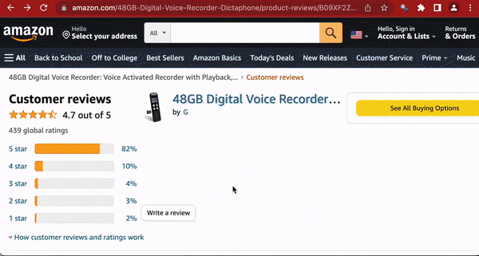

The answers to all the fill-in-the-blank sections can be found [here](https://github.com/r-journalism/chjr/blob/main/inst/tutorials/scraping/scraping.Rmd).

```{r, warning=F, message=F}
library(tidyverse)
library(rvest)
```


## rvest

We'll use a new package called [**rvest**](https://rvest.tidyverse.org/) and it's part of the tidyuniverse bundle. 

Load the library.

```{r}
library(rvest)
```

Let's pull reviews from Amazon for [this digital voice recorder](https://www.amazon.com/48GB-Digital-Voice-Recorder-Dictaphone/dp/B09XF2Z12G/). 


```{r files-image32, out.width = "80%", echo=F}

```

Let's track them down.

Scroll down to near the bottom of the product page are about 8 listed reviews. At the bottom of that section is a link for `See all reviews>`. Let's go see those reviews.

**Note:** Here's a tip.

The URL to the reviews may look like (once you strip out all the `ref` tracking code:

`https://www.amazon.com/48GB-Digital-Voice-Recorder-Dictaphone/product-reviews/B09XF2Z12G/`

But if you try this link, it works just as well.

`https://www.amazon.com/product-reviews/B09XF2Z12G/`

Turns out you don't need the product name, only the Amazon id.

Let's request the data from the server.

We'll use the `read_html()` function. It takes a URL as an argument.

Sub in the html of the digital voice recorder (second link) and the correct function name and run the code.

```{r rvest, eval=F}
url <- "_____"

amazon <- _________(url)

amazon
```

```{r rvest-solution, eval=F, echo=F}
url <- "https://www.amazon.com/product-reviews/B09XF2Z12G/"

amazon <- read_html(url)

amazon
```

Great job, we've imported an html page into R.

Now let's extract what we want.

## Parse HTML


There are a lot of data we could get but let's focus on these elements:

* Number of stars (out of 5)
* Date review was posted
* Text of review

We'll need to find the HTML/CSS elements to target.

One way is to use [**inspect element**](https://www.freecodecamp.org/news/how-to-inspect-an-element-chrome-shortcut/) but since we've already installed **selector gadget** we'll use that instead.

Okay, scroll past the first two banner reviews and go to the reviews in the list. 

Click on the **selector gadget** button in the browser and click on the stars.

A pop up box will show up on the bottom right and after you click on the first stars, `.review-rating` will appear. What you selected also is highlighted in green and similar elements on the web page that match that `.review-rating` will also be highlighted green and yellow.

However, when double checking, I see that the two banner reviews are included. I don't want those! So I can click on the green of one of them and it will exclude that and selector gadget will try to guess another element. This time, `#customer_review etc etc etc`, which is way too long and too specific because it excluded the stars below the first star we wanted. So we click on the stars beneath the first one we wanted and we finally get all the stars we wanted. *Look below to see how the path changes with each additional click to remove or add elements until we get the final one we want.* 


```{r files-image6, out.width = "100%", echo=F}

```

This time the final CSS class we want is `#cm_cr-review_list .review-rating`.

We need to pass that string into a new function: `html_elements()`. (An older version of rvest used to be `html_nodes()`)

We already have the read html saved in the **amazon** object.

Use the new function and the class below.

```{r read_html, eval=F}
amazon %>% 
  _________("__________________")
```


```{r read_html-solution, eval=F, echo=F}
amazon %>% 
  html_elements("#cm_cr-review_list .review-rating")
```


Alright, we're closer.

What that did was returned all the nodes in the HTML that have this particular `#cm_cr-review_list .review-rating` class. 

Now we need to extract the actual review number!

Let's pipe in `html_text()` with no arguments needed.

```{r html_text, eval=F}
ratings <- amazon %>% 
  _________("__________________") %>% 
  _________()

ratings
```


```{r html_text-solution, eval=F, echo=T}
ratings <- amazon %>% 
  html_elements("#cm_cr-review_list .review-rating") %>% 
  html_text()

ratings
```

Great job! 

Now we have an array with various star ratings.

We can go back and clean these later so we have just the raw number.

So, the **read_html()** and **html_elements()** and **html_text()** functions are all you'll need for many common web scraping tasks.

* Get the HTML for the webpage you want
* Decide what part of the page to focus on and figure out what HTML or CSS to select it
* Select that HTML and analyze it

There are others, though. 

* `html_attr()` for grabbing links
* `html_table()` to parse an html table into a data frame
* `html_form_submit()` if you want to set values in a form submission

To check it all out, visit the [rvest site](https://rvest.tidyverse.org/reference/index.html).


Keep going!!

## More scraping

In your browser, to exit the **select gadget** tool, you must click the "X" button on the far right of the pop up box.

Or click the 'clear' button if you want to select a new element.

Which is what you want to do!

Now, use the select gadget to find the path for the dates of the reviews (it may take 3 or 4 clicks of selector gadget to find just the right selection). We'll save it to the object "dates".

```{r html_text2, eval=F}
dates <- amazon %>% 
  html_elements("__________________") %>% 
  _________()

dates
```


```{r html_text2-solution, eval=F, echo=F}
dates <- amazon %>% 
  html_elements("#cm_cr-review_list .review-date") %>% 
  html_text()

dates
```


Finally, get me the text of the reviews from customers and save it to the object "review_text".

This may take 3-5 clicks on **selector gadget** to get just the right selection. Don't include banner text reviews and don't include text from other parts of the website.

```{r html_text3, eval=F}
review_text <- amazon %>% 
  _________("__________________") %>% 
  _________()

review_text
```


```{r html_text3-solution, eval=F, echo=F}
review_text <- amazon %>% 
  html_elements(".a-spacing-small.review-data") %>% 
  html_text()

review_text
```


Great job. Let's bring it all together in one pretty data frame.

```{r dataframe, eval=F}
some_reviews <- data.frame(ratings, dates, review_text)

glimpse(some_reviews)
```

That's a lot of strings!

We want the numbers and dates!

Okay, let's clean it up a bit with some **stringr** and **lubridate** functions.

```{r clean, eval=F}
some_reviews <- some_reviews %>% 
  mutate(
         # Need to get the ratings into a numeric format instead of sentence format
         ratings=str_replace(ratings, " out of 5 stars", ""),
         ratings=as.numeric(ratings),
         # Need to turn the dates into a date format instead of sentence format
         dates=str_replace(dates, ".* on ", ""),
         dates=mdy(dates),
         # Let's get rid of extra spaces and \ns that indicate line breaks in the html code
         review_text=str_trim(review_text))

glimpse(some_reviews)
```

Ah, much nicer.


## Looped scraping

Alright, not bad!

We have 10 reviews so far. 

But how do we get all the reviews?

Loops!
