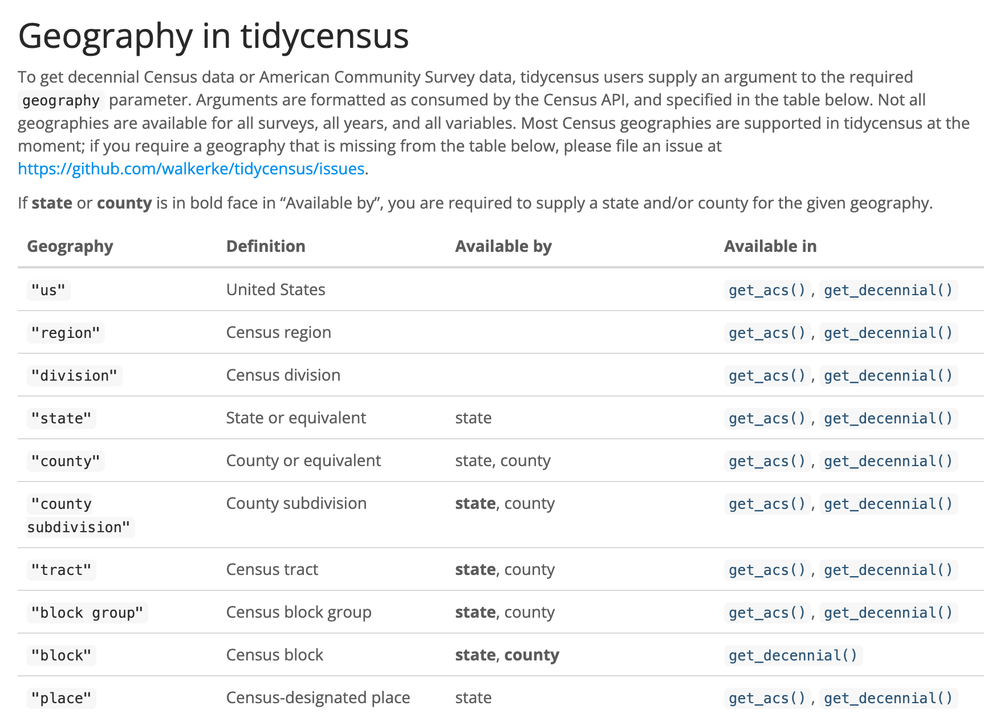
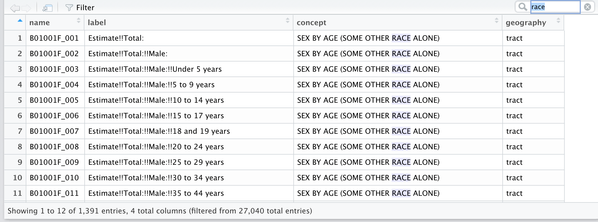
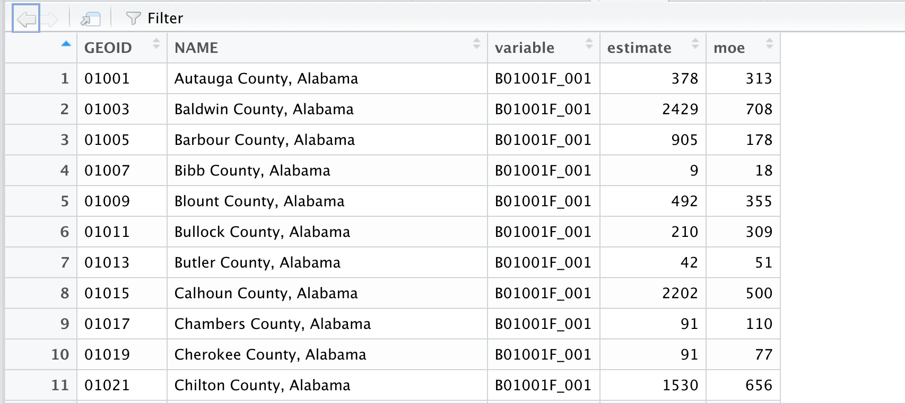
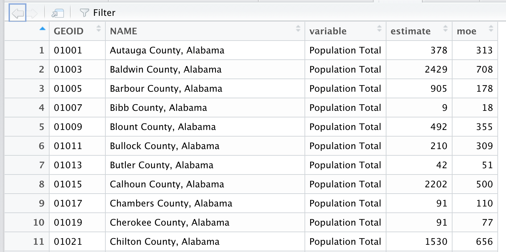
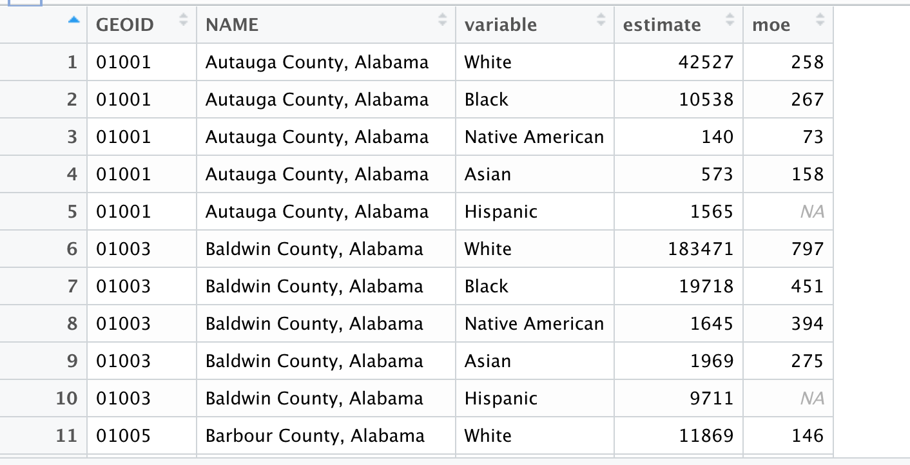
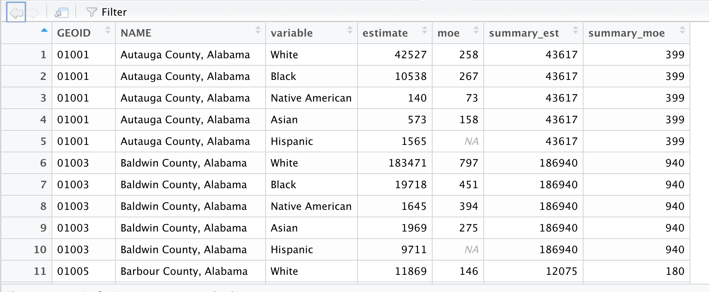
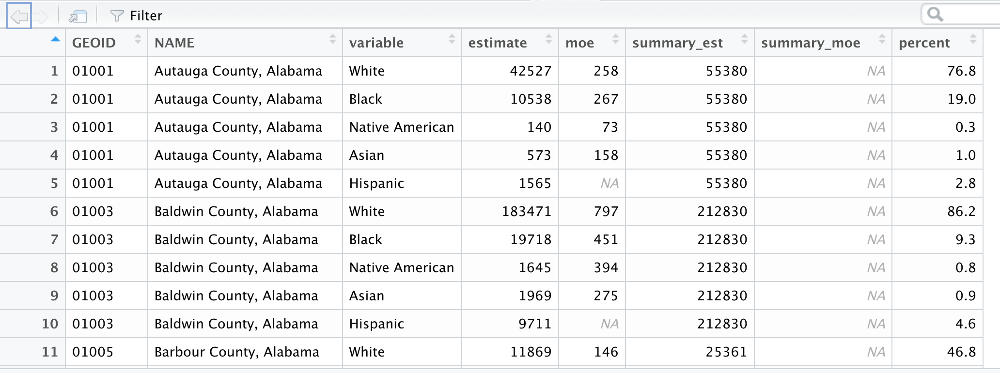
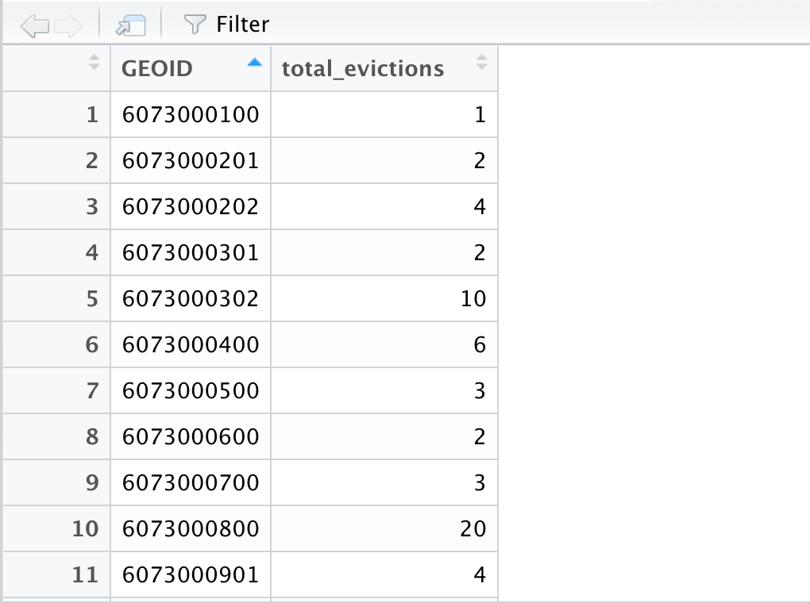
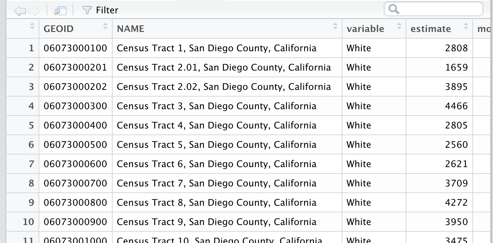
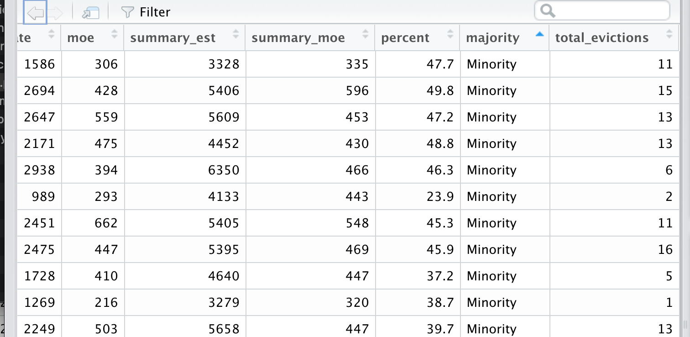

```{r setup, include=FALSE}
knitr::opts_chunk$set(echo = TRUE)
```

### Let's wrangle census data again

1. Open up RStudio.

2. Create a new project called "tidycensus" in a folder that makes sense.

3. Then, create a new .rmd file.

4. Call it "tidycensus" and save it as tidycensus.

5. Create a new R code chunk and put these lines in and run it (plug in your census api key)

```{r library, eval=F}
library(tidyverse)
library(tidycensus)

census_api_key("YOUR API KEY GOES HERE", install=TRUE)
```

```{r library2, echo=F}
library(tidycensus)
library(tidyverse)
```

### tidycensus functions




Alright, you can see there are two basic functions to get census survey data: `get_acs()` and `get_decennial()`

Just like when navigating the census data portal you need the following:

* geography
* survey type
* year

That's it!

Almost.

You also need the tables.

We can do that through R comprehensively.

### Searching for census variables

There are thousands of tables. Use the `load_variables()` function to look them up. However, you need two arguments:

* year
* survey
  * If ACS, `"acs1"` or `"acs5"` for 1-year survey or 5-year survey
  * if decennial, use `"pl"` for 2020 or `"sf1"` or `"sf2"` for 2010 and 2000.
  
Create a new R code chunk and put these lines in and run it (plug in your census api key)


```{r variables, eval=F}
v19 <- load_variables(2019, "acs5", cache = TRUE)

View(v19)
```

Let's look for "race" in the search bar of the table:




Notice that you've narrowed it down to 1,391 rows from 27,040.

That's still a lot of rows, still.

Let's grab the first one for population in general: `B01001F_001` - copy it from here or copy it from your table.

This is an acs table.

Let's pull this data for acs 5-year and for 2019.

The function is `get_acs()` remember?

What geography do you want?

Copy and paste the code below into a new chunk in your rmd file and choose a geography based on the options above.

Remember, depending on your geography, you may need to include additional arguments, like state and/or county.

```{r acs1, eval=F}
df <- get_acs(geography = "?",
              variables = "paste in your table code here",
              #state = "?",
              year = 2019,
              survey = "acs5")

View(df)
```

I'm going to try it with county for the entire country. (You don't to run the code below) 

I won't need state.

```{r acs1b, eval=F}
df <- get_acs(geography = "county",
              variables = "B01001F_001",
              year = 2019,
              survey = "acs5")

View(df)
```

Okay, I've got population and margin of errors.

But this is ugly:


Variable: B01001F_001 - That's not exactly readable.

One way to swap that out is to use `case_when()` but we can alter the variable names in the `get_acs()` call.

Here's how. Copy and paste the code below and run it in your rmd file.

Fill in the arguments for geography and year again, but this time fill in: "Population Total"


```{r acs2, eval=F}
df <- get_acs(geography = "?",
              variables = c("FILL IN WHAT?"="B01001F_001"),
              #state = "?",
              year = 2019,
              survey = "acs5")

View(df)
```
I'm going to run it on my county call.

```{r acs2b, eval=F}
df <- get_acs(geography = "county",
              variables = c("Population Total"="B01001F_001"),
              #state = "?",
              year = 2019,
              survey = "acs5")

View(df)
```



See? `B01001F_001` is `Population Total` which is way more readable!

Okay, here's a challenge, search through the variables list and pull in the population for race alone:

* White
* Black
* Hispanic
* Asian
* Native American

Then run the call

```{r acs3b, eval=F}
df <- get_acs(geography = "county",
              variables = c("White"="TABLE_ID",
                            "Black"="TABLE_ID",
                            "Asian"="TABLE_ID",
                            "Native American"="TABLE_ID",
                            "Hispanic"="TABLE_ID", # THIS ONE IS TRICKY),
              #state = "?",
              year = 2019,
              survey = "acs5")

View(df)
```

```{r acs4bd, eval=F, echo=F}
df <- get_acs(geography = "county",
              variables = c("White"="B02001_002",
                            "Black"="B02001_003",
                            "Asian"="B02001_005",
                            "Native American"="B02001_004",
                            "Hispanic"="B03002_012" ),
              #state = "?",
              year = 2019,
              survey = "acs5")

View(df)
```

Congrats, you've got tidy data!



Each row is a different race for a different county.

This will be easier to wrangle with dplyr verbs.

What if we wanted to bring in total population so we can calculate race percent by row?

Well, `get_acs()` makes that easy to do!

Simply add an argument called `summary_var` and give it the table id for total!

Can you find it in the table and sub it out in the code below?

Run it in your rmd when you figure it out.


```{r acs4b, eval=F}
df <- get_acs(geography = "county",
              variables = c("White"="TABLE_ID",
                            "Black"="TABLE_ID",
                            "Asian"="TABLE_ID",
                            "Native American"="TABLE_ID",
                            "Hispanic"="TABLE_ID", # THIS ONE IS TRICKY),
              #state = "?",
              summary_var = "TABLE_ID",
              year = 2019,
              survey = "acs5")

View(df)
```

```{r acs4bc, eval=F, echo=F}
df <- get_acs(geography = "county",
              variables = c("White"="B02001_002",
                            "Black"="B02001_003",
                            "Asian"="B02001_005",
                            "Native American"="B02001_004",
                            "Hispanic"="B03002_012" ),
              #state = "?",
              year = 2019,
              summary_var = "B02008_001",
              survey = "acs5")

View(df)
```



Now we're getting somewhere.

Your turn, take the code above and use `mutate()` to add a new column that calculates percent race.


```{r acs5b, eval=F, echo=F}
df <- get_acs(geography = "county",
              variables = c("White"="B02001_002",
                            "Black"="B02001_003",
                            "Asian"="B02001_005",
                            "Native American"="B02001_004",
                            "Hispanic"="B03002_012" ),
              #state = "?",
              year = 2019,
              summary_var = "B02001_001",
              survey = "acs5") %>% 
  mutate(percent=round(estimate/summary_est*100,1))

View(df)
```

If you wrote in your code correctly, it should give you this:



Alright, your turn again.

If you wanted to figure out which counties were White majority or Minority majority, what would you do?

Hint: You'll need to use `filter()` and `mutate()` with `case_when()`

Think about it...


```{r acs6b, eval=F, echo=F}
df <- get_acs(geography = "county",
              variables = c("White"="B02001_002",
                            "Black"="B02001_003",
                            "Asian"="B02001_005",
                            "Native American"="B02001_004",
                            "Hispanic"="B03002_012" ),
              #state = "?",
              year = 2019,
              summary_var = "B02001_001",
              survey = "acs5") %>% 
  mutate(percent=round(estimate/summary_est*100,1)) %>% 
  filter(variable=="White") %>% 
  mutate(majority=case_when(
    percent >50 ~ "White",
    TRUE ~ "Minority"
  ))

View(df)
```


Alright, next question:

How many counties are majority White?

How many counties are majority Not White?


### join with data

Let's bring in some eviction data:

```{r evictions}

sd_evictions <- read_csv("https://docs.google.com/spreadsheets/d/e/2PACX-1vQuRufdl7-1ynALWyahaEw1EK7VTCRoU3bRdHR4ajGrvHUhWAUVYnUekzBr0rJHcSzbLaDIH6pKbwZr/pub?output=csv")
```

```{r eval=F}
View(sd_evictions)

```



Okay, can you bring in `tract` data by race in the state `CA` in the county `San Diego`? 

Call this table `sd`.

```{r san_diego1, eval=F}

sd <- get_acs(geography = "?????",
              variables = c("White"="B02001_002",
                            "Black"="B02001_003",
                            "Asian"="B02001_005",
                            "Native American"="B02001_004",
                            "Hispanic"="B03002_012" ),
              state = "??",
              county = "??????",
              year = 2019,
              summary_var = "B02001_001",
              survey = "acs5") %>% 
  mutate(percent=round(estimate/summary_est*100,1)) %>% 
  filter(variable=="White") %>% 
  mutate(majority=case_when(
    percent >50 ~ "White",
    TRUE ~ "Minority"
  ))

View(sd)
```

```{r sdcensus, echo=F}
sd <- get_acs(geography = "tract",
              variables = c("White"="B02001_002",
                            "Black"="B02001_003",
                            "Asian"="B02001_005",
                            "Native American"="B02001_004",
                            "Hispanic"="B03002_012" ),
              state = "CA",
              county = "San Diego",
              year = 2019,
              summary_var = "B02001_001",
              survey = "acs5") %>% 
  mutate(percent=round(estimate/summary_est*100,1)) %>% 
  filter(variable=="White") %>% 
  mutate(majority=case_when(
    percent >50 ~ "White",
    TRUE ~ "Minority"
  ))
```



Okay, let's join them!

You'll need to mutate the `GEOID` in `sd` to numeric so it'll join successfully.

Join `sd_evictions` to `sd` tables together on `GEOID` after first converting `GEOID` to numeric.

```{r sd_join}
sd <- sd %>% 
  mutate(GEOID=as.numeric(GEOID))

sd <- left_join(sd, sd_evictions)
```



Now we can group up the census tracts by race majority and figure out which tracts have higher rates of evictions.

```{r rate, eval = F}
sd %>% 
  group_by(majority) %>% 
  summarize(pop = sum(estimate, na.rm=T), evictions=sum(total_evictions, na.rm=T)) %>% mutate(evictions/pop*1000)
```

